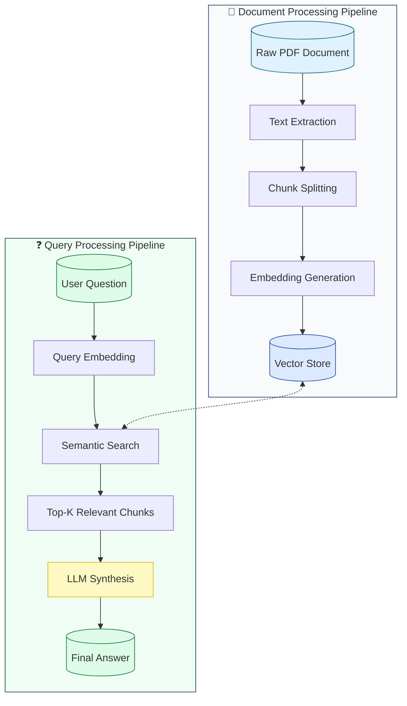

# Spring AI RAG Demo

This project is a demonstration of implementing Retrieval Augmented Generation (RAG) using Spring AI and OpenAI's GPT models. It showcases how to enable intelligent document querying by leveraging the capabilities of Large Language Models (LLMs) alongside local document context.


## Overview

This project illustrates how to:
- Import PDF documents into a vector database
- Conduct semantic searches with Spring AI
- Enhance LLM responses with pertinent document context
- Develop an API endpoint for document-aware chat interactions

## Getting Started

1. Set up your environment variables:
```properties
OPENAI_API_KEY=your_api_key_here
```

## Running the Application

1. Start Docker Desktop.

2. Run the application:
```bash
./mvnw spring-boot:run
```

The application will:
- Start a PostgreSQL database with the PGVector extension
- Initialize the vector store schema
- Ingest documents from the specified location
- Start a web server on port 8080

## Key Components

### DocumentIngestionService

The `DocumentIngestionService` is responsible for processing documents and populating the vector store.

The sample PDF document used for this sample is placed in the `src/main/resources/docs` directory.

### ChatController

The `ChatController` provides a REST endpoint for querying the document and generating insights.

## Testing / Example Queries

### Factual Queries
Get specific information about monetary policy decisions:

> What was the Federal Reserve interest rate cut?

```bash
curl "http://localhost:8080/api/v1/analysis/factual?query=What%20was%20the%20Federal%20Reserve%20interest%20rate%20cut?"
```

### Analytical Queries 
Compare performance across different market sectors:

> Compare the performance of REITs versus bank stocks

```bash
curl "http://localhost:8080/api/v1/analysis/analytical?query=Compare%20the%20performance%20of%20REITs%20versus%20bank%20stocks"
```

### Complex Relationship Queries
CUnderstand interconnected market impacts:

> How did the rate cut affect both dollar and emerging markets?

```bash
curl "http://localhost:8080/api/v1/analysis/complex?query=How%20did%20the%20rate%20cut%20affect%20both%20dollar%20and%20emerging%20markets?"
```

### Forward-Looking Queries
Identify potential risks and future implications:

> What are the main risk factors identified?

```bash
curl "http://localhost:8080/api/v1/analysis/forward?query=What%20are%20the%20main%20risk%20factors%20identified?"
```

> **Note:** To see only the response content:

**Windows PowerShell:**
```powershell
curl "http://localhost:8080/api/v1/analysis/factual?query=What%20was%20the%20rate%20cut?" | Select-Object -ExpandProperty Content
```

**Unix/Linux/MacOS:**
```bash
curl "http://localhost:8080/api/v1/analysis/factual?query=What%20was%20the%20rate%20cut?" -s | jq -r '.content'
```

### License

MIT License - See [LICENSE](/LICENSE) for details.