# Spring AI RAG Demo


A demonstration of **Retrieval Augmented Generation (RAG)** using Spring AI and OpenAI's GPT models. This project showcases how to build intelligent document querying systems by combining Large Language Models (LLMs) with local document context and vector databases.

## 🎯 Key Features

- **📄 PDF Document Ingestion** - Automatic processing and vectorization of PDF documents
- **🔍 Semantic Search** - Advanced similarity search using PostgreSQL with PGVector extension  
- **🤖 AI-Powered Analysis** - Specialized endpoints for different types of financial queries
- **🐳 Docker Setup** - Simple Docker Compose configuration for easy local development
- **🎛️ Smart Caching** - Efficient document store management with duplicate prevention

```mermaid
flowchart TB
    subgraph DocumentPipeline["📄 Document Processing Pipeline"]
        direction TB
        A[("Raw PDF Document")] --> B[Text Extraction]
        B --> C[Chunk Splitting]
        C --> D[Embedding Generation]
        D --> E[(Vector Store)]
    end

    subgraph QueryPipeline["❓ Query Processing Pipeline"]
        direction TB
        F[("User Question")] --> G[Query Embedding]
        G --> H[Semantic Search]
        H --> I[Top-K Relevant Chunks]
        I --> J[LLM Synthesis]
        J --> K[("Final Answer")]
    end

    E <-.-> H

    style DocumentPipeline fill:#f8fafc,stroke:#1e3a8a
    style QueryPipeline fill:#f0fdf4,stroke:#14532d
    style A fill:#e0f2fe,stroke:#0369a1
    style E fill:#dbeafe,stroke:#1d4ed8
    style F fill:#dcfce7,stroke:#15803d
    style K fill:#dcfce7,stroke:#15803d
    style J fill:#fef9c3,stroke:#eab308
```



## 🚀 Quick Start

### Prerequisites

- **Java 21** or higher
- **Docker Desktop** (for PostgreSQL + PGVector)
- **OpenAI API Key**

### Setup & Run

1. **Clone the repository**
```bash
git clone <your-repo-url>
cd spring-ai-rag-demo
```

2. **Set your OpenAI API key**
```bash
# Linux/macOS
export OPENAI_API_KEY=your_api_key_here

# Windows PowerShell
$env:OPENAI_API_KEY="your_api_key_here"

# Or create .env file
echo "OPENAI_API_KEY=your_api_key_here" > .env
```

3. **Start the application**
```bash
./mvnw spring-boot:run
```

The application automatically:
- 🐘 Starts PostgreSQL database with PGVector extension
- 📊 Initializes vector store schema
- 📄 Ingests sample PDF document (if not already processed)
- 🌐 Starts web server on **http://localhost:8080**

## 🔧 Architecture & Components

### 📄 DocumentIngestionService
Handles PDF processing and vector store population:
- **Smart Ingestion** - Checks if documents are already processed
- **Token Splitting** - Optimally chunks documents for embedding
- **Vector Storage** - Stores embeddings in PostgreSQL with PGVector

### 🎯 ChatController
Provides specialized REST endpoints for different query types:
- **`/factual`** - Extract specific data points and figures
- **`/analytical`** - Comparative analysis across sectors
- **`/complex`** - Multi-factor relationship analysis  
- **`/forward`** - Risk assessment and strategic implications

## 📝 API Examples

### 💰 Factual Queries
Get specific information about monetary policy decisions:

```bash
curl "http://localhost:8080/api/v1/analysis/factual?query=What%20was%20the%20Federal%20Reserve%20interest%20rate%20cut?"
```

### 📊 Analytical Queries 
Compare performance across different market sectors:

```bash
curl "http://localhost:8080/api/v1/analysis/analytical?query=Compare%20the%20performance%20of%20REITs%20versus%20bank%20stocks"
```

### 🔗 Complex Relationship Queries
Understand interconnected market impacts:

```bash
curl "http://localhost:8080/api/v1/analysis/complex?query=How%20did%20the%20rate%20cut%20affect%20both%20dollar%20and%20emerging%20markets?"
```

### 🔮 Forward-Looking Queries
Identify potential risks and future implications:

```bash
curl "http://localhost:8080/api/v1/analysis/forward?query=What%20are%20the%20main%20risk%20factors%20identified?"
```

### 📤 Response Format

All endpoints return plain text responses optimized for readability:

```bash
# Extract just the response content (Unix/Linux/macOS)
curl "http://localhost:8080/api/v1/analysis/factual?query=What%20was%20the%20rate%20cut?" -s | jq -r '.content'

# Windows PowerShell
curl "http://localhost:8080/api/v1/analysis/factual?query=What%20was%20the%20rate%20cut?" | Select-Object -ExpandProperty Content
```

## 🛠️ Technical Stack

| Technology | Purpose | Version |
|------------|---------|---------|
| **Spring Boot** | Application Framework | 3.4.2 |
| **Spring AI** | LLM Integration | 1.0.0-M5 |
| **PostgreSQL** | Vector Database | 16 |
| **PGVector** | Vector Extension | Latest |
| **OpenAI GPT** | Language Model | GPT-4o-mini |
| **Docker Compose** | Container Orchestration | Latest |
| **Java** | Runtime | 21 |

## 🎛️ Configuration

### Environment Variables
```properties
OPENAI_API_KEY=your_openai_api_key_here
```

### Application Configuration
Key configuration in `application.yaml`:
```yaml
spring:
  ai:
    openai:
      api-key: ${OPENAI_API_KEY}
      chat:
        options:
          model: gpt-4o-mini
          temperature: 0.7
    vectorstore:
      pgvector:
        initialize-schema: true
```

### Docker Setup
The `compose.yaml` automatically configures:
- PostgreSQL 16 with PGVector extension
- Database: `markets`
- Credentials: `user/password`
- Port: `5432`

## 🚀 Development Workflow

### Adding New Documents
1. Place PDF files in `src/main/resources/docs/`
2. Update `DocumentIngestionService` to reference new files
3. Restart application - new documents will be automatically processed

### Customizing Query Types
1. Add new prompt templates in `ChatController.SPECIALIZED_PROMPTS`
2. Create corresponding endpoint methods
3. Test with sample queries

### Database Management
```bash
# Connect to PostgreSQL
docker exec -it <container_name> psql -U user -d markets

# View vector store tables
\dt

# Check document count
SELECT COUNT(*) FROM vector_store;
```

## 📄 License

MIT License - See [LICENSE](LICENSE) for details.